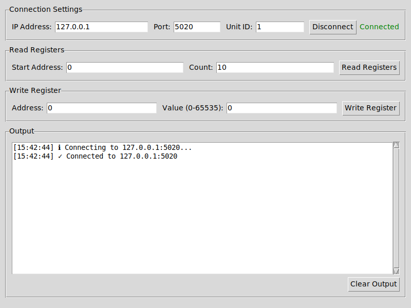
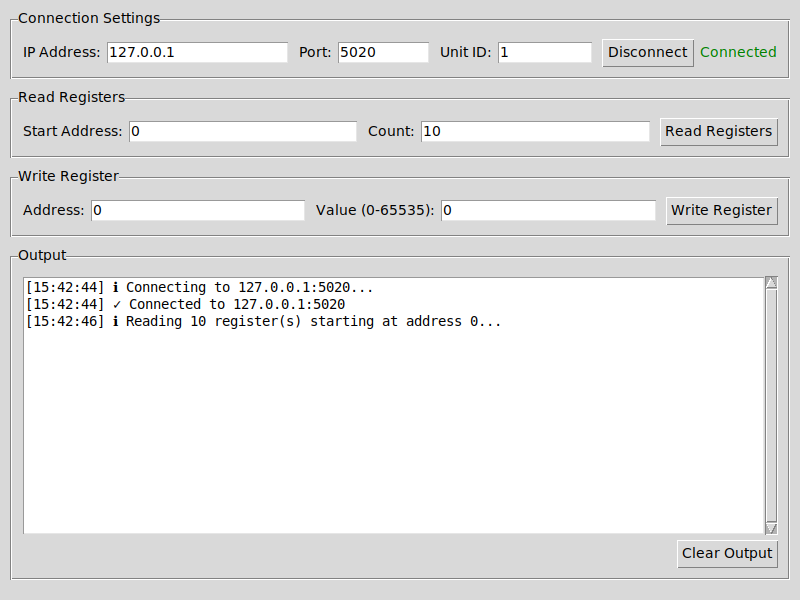
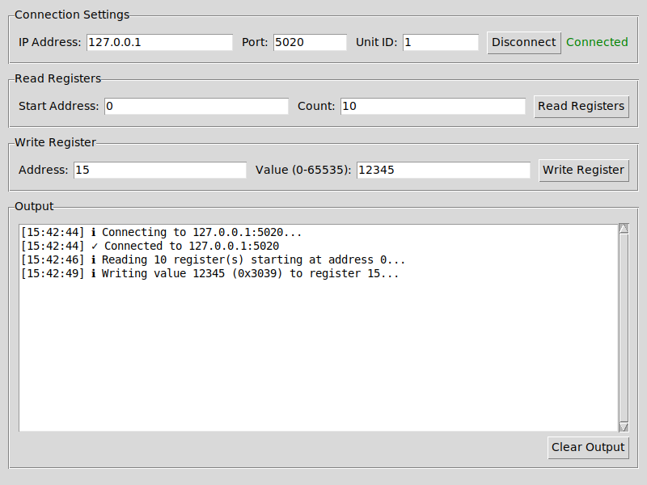

# Modbus TCP Master GUI

A cross-platform graphical tool for testing Modbus TCP communication. This tool provides an easy-to-use interface for reading and writing Modbus TCP holding registers.

## Features

- ✅ **Graphical User Interface (GUI)** - Easy-to-use cross-platform interface
- ✅ Read a range of holding registers (up to 1000 at once)
- ✅ Write uint16 values (0-65535) to registers
- ✅ Cross-platform compatibility (Windows, Linux, macOS)
- ✅ Support for custom TCP ports and unit IDs
- ✅ Automatic write verification
- ✅ Clear formatted output with decimal and hexadecimal values
- ✅ Real-time connection status
- ✅ Timestamped operation logging
- ✅ **Configuration persistence** - Automatically saves and restores settings

## Download Pre-built Executables

If you don't want to install Python and dependencies, you can download pre-built executables:

- **Windows**: Download `.exe` file from the [Releases page](https://github.com/ashajkofci/GUIModbusClientMaster/releases)
- **macOS**: Download `.dmg` file from the [Releases page](https://github.com/ashajkofci/GUIModbusClientMaster/releases)
- **Linux (Debian/Ubuntu)**: Download `.deb` file from the [Releases page](https://github.com/ashajkofci/GUIModbusClientMaster/releases)

### Linux Installation

After downloading the `.deb` file:
```bash
sudo dpkg -i ModbusTCPMaster-v*.deb
sudo apt-get install -f  # Install dependencies if needed
```

Then run from terminal:
```bash
modbustcpmaster
```

## Requirements (For Running from Source)

- Python 3.7 or higher
- pymodbus library
- tkinter (for GUI - usually included with Python)

## Installation (For Running from Source)

1. Clone this repository or download the files
2. Install dependencies:

```bash
pip install -r requirements.txt
```

Or install manually:

```bash
pip install pymodbus
```

**Note for Linux users:** You may need to install tkinter separately:
```bash
# Ubuntu/Debian
sudo apt-get install python3-tk

# Fedora/RHEL
sudo dnf install python3-tkinter
```

## Usage

### Starting the GUI Application

The GUI provides an intuitive interface for interacting with Modbus TCP devices.

**Start the GUI:**

```bash
python modbus_gui.py
```

or on some systems:

```bash
python3 modbus_gui.py
```

**GUI Features:**

1. **Connection Settings**
   - Enter IP address of the Modbus server
   - Configure TCP port (default: 502)
   - Set Modbus unit/slave ID (default: 1)
   - Connect/Disconnect button with status indicator

2. **Read Registers**
   - Enter start address
   - Specify number of registers to read
   - Click "Read Registers" to fetch values
   - Results display in both decimal and hexadecimal format

3. **Write Register**
   - Enter register address
   - Enter uint16 value (0-65535)
   - Click "Write Register" to write value
   - Automatic verification of written value

4. **Output Window**
   - Real-time logging of all operations
   - Timestamp for each action
   - Color-coded status indicators (✓ success, ✗ error, ℹ info)
   - Clear button to reset output

**GUI Screenshots:**


*GUI interface after connecting to a Modbus server*


*Reading multiple registers with formatted output*


*Writing a value to a register with automatic verification*

## User Interface Overview

### 1. Connection Settings (Top Section)

**Fields:**
- **IP Address**: Enter the IP address of your Modbus TCP server (e.g., 192.168.1.100)
- **Port**: TCP port number (default: 502)
- **Unit ID**: Modbus unit/slave ID (default: 1)
- **Connect/Disconnect Button**: Toggles connection state
- **Status Indicator**: Shows "Connected" (green) or "Disconnected" (red)

**Usage:**
1. Enter the IP address of your Modbus device
2. Adjust port and unit ID if needed (most devices use port 502 and unit ID 1)
3. Click "Connect"
4. Wait for green "Connected" status

### 2. Read Registers Section

**Fields:**
- **Start Address**: The first register address to read from (e.g., 0)
- **Count**: Number of consecutive registers to read (e.g., 10)
- **Read Registers Button**: Executes the read operation

**Usage:**
1. Ensure you're connected to the server
2. Enter the starting register address
3. Enter how many registers you want to read (1-1000)
4. Click "Read Registers"
5. Results appear in the output window showing:
   - Register address
   - Value in decimal format
   - Value in hexadecimal format

**Example:**
- Start Address: 0
- Count: 10
- Result: Reads registers 0-9

### 3. Write Register Section

**Fields:**
- **Address**: Single register address to write to (e.g., 5)
- **Value (0-65535)**: The uint16 value to write
- **Write Register Button**: Executes the write operation

**Usage:**
1. Ensure you're connected to the server
2. Enter the register address
3. Enter a value between 0 and 65535
4. Click "Write Register"
5. The operation is performed and verified automatically
6. Results appear in the output window

**Important Notes:**
- Values must be in the range 0-65535 (uint16)
- The GUI automatically verifies the write by reading back the value
- Writes to one register at a time

### 4. Output Window (Bottom Section)

**Features:**
- Real-time logging of all operations
- Timestamp for each action ([HH:MM:SS])
- Status indicators:
  - ✓ Success (green checkmark)
  - ✗ Error (red X)
  - ℹ Information (info icon)
- Scrollable text area
- **Clear Output Button**: Clears all messages

**Log Messages Include:**
- Connection/disconnection events
- Read operations with formatted results
- Write operations with verification status
- Error messages with descriptions

## Example Workflow

### Reading Registers

1. Start the GUI: `python modbus_gui.py`
2. Enter connection details:
   - IP Address: 192.168.1.100
   - Port: 502
   - Unit ID: 1
3. Click "Connect"
4. Configure read operation:
   - Start Address: 0
   - Count: 10
5. Click "Read Registers"
6. View results in output window

### Writing a Register

1. Ensure you're connected (follow steps 1-3 above)
2. Configure write operation:
   - Address: 5
   - Value: 1234
3. Click "Write Register"
4. Check output window for:
   - Write confirmation
   - Verification result

### Disconnecting

1. Click "Disconnect" button when finished
2. Status changes to "Disconnected" (red)
3. Read and Write buttons become disabled

## Value Range

When writing registers, values must be in the uint16 range:
- **Minimum:** 0
- **Maximum:** 65535 (0xFFFF)

Values outside this range will be rejected with an error message.

## Keyboard Shortcuts

- **Tab**: Navigate between fields
- **Enter**: Submit current field (same as clicking button)
- **Escape**: No direct shortcut, use mouse to close window

## Cross-Platform Compatibility

This tool is designed to work on:
- **Windows** (10/11 and Server versions)
- **Linux** (Ubuntu, Debian, CentOS, etc.)
- **macOS** (10.14+)

The tool uses pure Python and the pymodbus library, ensuring consistent behavior across all platforms.

### Platform-Specific Notes

**Windows:**
- Double-click modbus_gui.py or run from Command Prompt
- tkinter is included with Python installation
- May need to allow firewall access for Modbus TCP

**Linux:**
- Run from terminal: `python3 modbus_gui.py`
- Install tkinter if needed: `sudo apt-get install python3-tk` (Ubuntu/Debian) or `sudo dnf install python3-tkinter` (Fedora/RHEL)
- May need sudo for ports below 1024

**macOS:**
- Run from terminal: `python3 modbus_gui.py`
- tkinter is included with Python installation
- May need to grant network permissions

## Testing with a Modbus Simulator

If you don't have a physical Modbus device, you can test with the included test server or a Modbus simulator:

**Using the included test server:**
```bash
python test_server.py
```
This starts a test server on 127.0.0.1:5020 with pre-configured test values.

**Or use a third-party simulator:**
1. Install a Modbus TCP simulator/server (e.g., ModRSsim2, pymodbus simulator)
2. Configure it to listen on the desired port (default 502)
3. Connect the GUI to the simulator's IP address and port

## Tips and Best Practices

- **Connection Issues**: Check IP address, port, and network connectivity
- **Timeout Errors**: Server might be slow or unreachable
- **Value Errors**: Ensure values are within 0-65535 range
- **Address Errors**: Valid register addresses are typically 0-65535
- **Multiple Reads**: You can read up to 1000 registers at once
- **Output History**: Use "Clear Output" to reset the log when needed
- **Testing**: Use the included `test_server.py` for local testing without physical hardware

## Configuration Persistence

The application automatically saves your settings and restores them the next time you start the application. This includes:

- **IP Address**: Last used Modbus server IP address
- **Port**: Last used TCP port number
- **Unit ID**: Last used Modbus unit/slave ID
- **Read Start Address**: Last used starting register address for read operations
- **Read Count**: Last used number of registers to read

### Configuration File Location

The configuration is stored in a platform-specific user directory:

- **Windows**: `%APPDATA%\ModbusTCPMaster\config.json`
  - Example: `C:\Users\YourName\AppData\Roaming\ModbusTCPMaster\config.json`
- **macOS**: `~/Library/Application Support/ModbusTCPMaster/config.json`
  - Example: `/Users/YourName/Library/Application Support/ModbusTCPMaster/config.json`
- **Linux**: `~/.config/ModbusTCPMaster/config.json`
  - Example: `/home/username/.config/ModbusTCPMaster/config.json`

The configuration file is automatically created when you close the application and is loaded when you start it. The directory is created automatically and requires no special permissions.

### Resetting Configuration

If you want to reset to default settings, simply delete the configuration file. The application will create a new one with default values on the next start.

## Troubleshooting

### GUI Won't Start

**Problem**: Window doesn't appear
**Solution**: 
- Check if tkinter is installed: `python3 -c "import tkinter"`
- Install if missing (see Installation section)

### Can't Connect

**Problem**: Connection fails
**Solutions**:
- Verify IP address is correct
- Check if Modbus server is running
- Verify port number (usually 502)
- Check firewall settings
- Try pinging the server: `ping <ip_address>`

### Connection Refused
- Verify the server IP address and port
- Check if the Modbus TCP server is running
- Verify firewall settings allow TCP connections on the Modbus port

### Timeout Errors
- Server might be slow or unreachable
- Check network connectivity
- Verify the server is responding

### Write Verification Fails

**Problem**: Write succeeds but verification shows different value
**Possible Causes**:
- Server modified the value
- Another client changed the value
- Register is read-only
- Network delay or packet loss

### Error Messages

Common error messages and their meanings:
- "Not connected to server": Click Connect first
- "Invalid port number": Port must be a number (typically 502)
- "Value must be between 0 and 65535": Enter a valid uint16 value
- "Count must be between 1 and 1000": Adjust register count
- "Connection error": Check network and server availability

### Permission Errors
On Linux, ports below 1024 may require sudo:
```bash
sudo python3 modbus_gui.py
```

## License

This project is licensed under the BSD 3-Clause License - see the [LICENSE](LICENSE) file for details.

## Author

Adrian Shajkofci

## Contributing

Feel free to submit issues and enhancement requests!
